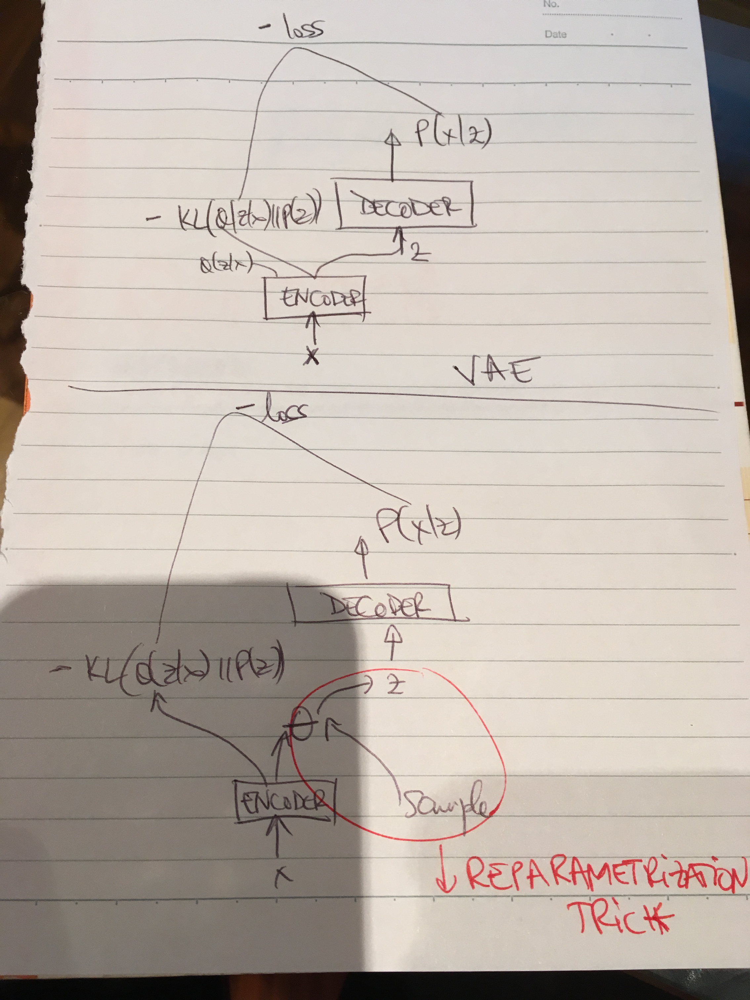

# Playing Atari with Deep Reinforcement Learning
* https://arxiv.org/pdf/1312.5602v1.pdf
* Core idea: apply Q learning to Atari, approximate the Q value using a conv net
* Train the network to minimize the TD error R + delta * max_a Q(s_(t+1), a) - Q(s_t, a).
* During optimization, keep the parameters off the Q(s_(t+1), a) term fixed. You make a copy of the Q network and call this the target network.
* Practical points that make it work
   * Experience replay
      * Avoid correlation of samples used to train the network by creating a buffer of experience. When training the Q network, take a mini batch from the buffer and use it for training. When playing the game, keep adding tuples of reward, action, state, state at next step. The buffer will contain these tuples and can have a maximal capacity (you can prioritize what you get out of the buffer and how you replace the elements in the buffer when the buffer is full).
   * Frame stacking
      * To create the states of the RL problem, stack 4 consecutive screens of the game. This fixes some pixel problems with Atari and shows the model how the frames are changing according to actions.
   * Target network update
      * Since the target network is fixed during optimization, one can decide to update the target network every C updates of the Q network. This minimizes oscilations in updates and the chance of divergence.
   * Error function change
      * The error term from the TD update is clipped to be between -1 and 1. This effectively makes the loss function to be the absolute value of the difference for values that are not in between -1 and 1.

# Variational autoencoders
  * https://arxiv.org/abs/1312.6114
  * Aim: density estimation
  * How: Model P(x) as P(x|z) * P(z), where z are latent variables and P(z) is
  a standard normal.
  * P(x|z) can be modelled using a parametrized distributions, with the parameters learned by a neural network.
  * Issue: when trying to find P(x) (after learning), we have to sample a lot of
  z from the prior of z to get an accurate estimate of P(x), since a lot of
  latents will not contribute to the data instance x (ie. P(x|z) will be low).
  * Idea: When estimating x, instead of sampling from z, sample from a distribution Q(z|x) which models how likely it is that z will generate x. If we had this distribution, we would not need as many samples to obtain an accurate estimate of P(x).
  * New aim: learn Q(z|x) when learning P(x|z) (hence the autoencoder formulation, Q(z|x) is the encoder distribution which models the distribution of the latents given the data, P(x|z) is the decoder distribution which models the encoder distribution of the data given the latents). The learning aim is to learn these two distribution to maximize the probability of the given data.
  * How? Start with the KL between Q(z|x) and P(z|x) and find a lower bound for P(x). This bound is given by the expected value under Q(z|x) of log P(x|z) minus the KL between Q(z|x) and P(z) (the former being the posterior of z and the latter being the prior of z).
  * Learning: use gradient descent. Both Q(z|x) and P(x|z) are distributions parametrized by a neural network. The key point of the paper is to ensure that gradients can be propagated through the encoder, by using the reparametrization trick. Without the reparametrization trick, in order to do a pass through the model (starting with a data point x and ending with the reconstruction of x), sampling would be needed after a forward pass in the encoder. Sampling after the encoder would make learning hard, since gradients would not backpropagate through sampling. The key observation of the paper is that for a lot of parametrized distributions, you can construct a sample from it by taking a sample of a non-parametrized distribution and applying a function of the parameters to that sample (for example, a sample of N(u, s^2) can be constructed by sampling N(0,1) and then applying lambda x: s * x + u to the sample). This trick allows the sampling to happen before the inputs are passed through the encoder, hence allowing the gradients to be backpropagated.
  * Sampling from a VAE: Sample from the prior of z and do a forward pass through the encoder.
  * Computing the approximate log probability of a data point under a VAE (note: this is just a lower bound): Compute the KL between Q(z|x) and P(z) and subtract it from the empirical estimate of expected value of log P(x|z) under Q(z|x). The first term (the KL, can often be obtained analytically for known distributions) and the second term can be estimated by sampling z from Q(z|x) and computing log P(x|z) using the sample.

  

# Generating images with recurrent adversarial networks
  * http://arxiv.org/abs/1602.05110
  * Motivation: generate good image samples
  * Abbreviation: GRAN
  * Similar models: LAGAN and DRAW
  * Idea:
    * image generation is an iterative process.
    * Start with a sample from the distribution of latent variables, feed it to the decoder to get an image. Feed the generated sample to the encoder, which will generate a vector representation of the image. Concatenate that representation with the sample from the distribution and feed that to the decoder, to generate another image. This process is repeated t times, with t fixed aprori. To generate the final image, the t image generated samples are added together and the tanh function is applied to ensure the final image has entries in between 0 and 1.
    * encoders and decoders can be represented by any function, they use deep convolutional adversarial nets
  * Evaluation idea:
    * to evaluate two GAN models, with discriminator D1 and generator G1 and discriminator D2 and generator G2, one cam compare them by seeing how well D1 can discriminate samples from G2 and how well D2 can discriminate samples from G1
  * Differences between proposed model and DRAW:
    * in DRAW at each time step, a new sample from the latent space is generated. In GRAN, only one sample is generated and then reused at each time step.
    * GRAN starts with the decoding phase, not with the encoding phase
    * GRAN has no attention mechanism
    * A discriminator from GRAN can differentiate between DRAW generated samples and images from MNIST with a 10% error

# Unitary evolution recurrent neural networks
  * http://arxiv.org/abs/1511.06464
  * Motivation: avoid exploding / vanishing gradient in RNNs
  * To avoid exploding and vanishing gradients, we need to use a matrix for recurrent corrections with eigen values 1 => we parametrize the matrix so that we ensure it is unitary
  * parametrize matrices with real entries is difficult and either results in a high computational complexity or too simple parametrization (use a matrix with non zero entries for the diagonal as a matrix for recurrent connections)
  * instead of working in real space, let's work in complex space => easier to find a definition for the matrix of the recurrent connections that is unitary in the complex space. This is computationally feasible and captures enough complexity for learning
  * memory & cost increase almost linearly with the size of the hidden layer
  * new activation function, relu for complex numbers
  * good results for Rnns example tasks (binary addition, etc), but not for a real life example

# Exponential linear units
  * http://arxiv.org/abs/1511.07289
  * Motivation: increase speed of learning and classification accuracy
  * Idea:
    * avoid vanishing gradient by using identity for positive values, but have negative values which allow to push the mean unit activation towards zero
    * zero mean activation brings the unit closer to the unit natural gradient
    * units that have a non-zero mean activation act as bias for the next layer
  * like batch normalization, they push the mean towards zero, but with less computational footprint
  * Elu formula:
    * x(f) = x for x >=0 and a(exp(x) - 1) for x < 0
    * a is a tunable hyperparameter
  * Idea behind natural gradient:
    * The parameter space can be complicated and not euclidean => the direction of the gradient is no longer appropriate => account for the curvature of the space
    * More [here](http://www.yaroslavvb.com/papers/amari-why.pdf)
  * Proof in paper:
    * Paper proves that zero mean activations speed up learning when the natural gradient is used
    * This applies to all techniques that strive to get zero mean activations (including batch normalization)
  * Results:
    * improvement in accuracy for network with more than 5 layers

# Multilingual language processing from bytes
 * http://arxiv.org/abs/1512.00103
 * Motivation: use one model for multiple languages for POS and NAR
 * Idea:
    * use a sequence to sequence model to predict POS and NAR
    * feed the model UTF-8 bytes (advantage: small vocabulary size)
  * Model name: Byte to span
  * At each time step the model does not predict a triple (start, len, pos), but rather learns to predict one of them at a different time step: t -> start, t+1 -> len, t+2 -> pos. The model learns not to mix them without much difficulty
  * Mentions that language models benefit from CNNs over characters to generate word embeddings (more [here](http://arxiv.org/abs/1508.06615))
  * Input segmentation:
    * They want the model to work on long documents, but RNNs have problems modelling long sequences
    * Instead, they split the input in segments of length K, using a sliding window
    * Has the advantage of being able to perform inference in parallel (per split segment)
    * Start and End predictions have a clear bound
    * In their experiments, they use k=60
  * Byte dropout:
    * Randomly replace a fraction of the input bytes with a special token
    * makes model ore robust
    * only done for the input later
  * Results:
    * one model for 11 languages with better results than having language individual models
    * requires no language specific engineering

# Exploiting Similarities among Language for Machine Translation
  * http://arxiv.org/abs/1309.4168
  * Motivation: Increase the size of language dictionaries from monolingual data
  * Idea:
    * It is easy to procure multilingual data, we can use that to learn embeddings in different languages
    * Learn a linear mapping from embeddings in the source language to embeddings in the target language from a small source language to target language dictionary
    * To expand the given source to target language dictionary:
      * take a word in the source language and compute its embedding
      * map the embedding to the target language using the learned mapping from the given dictionary
      * chose the word in the target language with the smallest cosine distance to the mapped embedding
  * Results:
    * Good sample translations from English to Spanish
  * Potential issue: at test time one needs to compute the cosine distance against all the words in the target vocabulary which can be very big. However, this is can be parallelized and clustering method can also be used to improve speed.
  * Use cases:
    * find mistakes in dictionaries
    * expand dictionaries to new words

# A Simple Way to Initialize RNNs of Relu
  * http://arxiv.org/abs/1504.00941
  * Motivation: RNNs hard to train due to vanishing & exploding gradients
  * Idea: use the identity matrix (or a scaled version) to initialize the recurrent connections
    * activation function: Relu
    * Initialize biases to 0 and the recurrent connection to the identity matrix.
  * Advantage: simple architecture compared to LSTMs
  * Results: comparable with LSTM on a couple of toy examples + speech recognition

# Recurrent neural network regularization
  * http://arxiv.org/abs/1409.2329
  * Use dropout for Recurrent Neural Nets for the input connections, but not for recurrent connections
  * Results:
    * minimize overfitting for LSTM training
    * good results for language modelling and image caption

# Neural networks with few multiplications
  * http://arxiv.org/abs/1510.03009
  * Motivation: big computational cost of NN training
  * Idea: avoid multiplication by binarizing weights (forward pass) and convert multiplication into binary shift (backward pass)
  * mention of Completely Boolean networks: simplify test time computation with acceptable hit in accuracy, but no training time is saved.
  * Binary connect:
    * Traditional: y = h (Wx + b)
    * Idea: sample each weight to be 1 or -1
    * p(w_{ij}) = (w'_{ij} + 1) / 2, where w'_{ij} is the usual weight value, but constrained to be in between -1 and 1 (by being capped)
    * random number generation has to be fast and not do a lot of multiplication for this to be worth it
  * Ternary connect
    * In NNs a lot of weights are 0 or close to 0 => allow weights to be 0
    * if w'_{ij} > 0, use P(w_{ij} = 1) =  w'_{ij}, 0 otherwise
    * if w'_{ij} < 0, use P(w_{ij} = - 1) =  - w'_{ij}, 0 otherwise
  * Quantized backpropagation:
    * do bit shifts in order to avoid multiplication, not for the gradient but for the input.
  * they use batch normalization in their architecture
  * Results:
    * qualitative: a bit better than using simple NNs and CNNs
    * no measure of speed improvements

# Generative adversarial networks
  * http://arxiv.org/abs/1406.2661
  * Motivation: generate good samples
  * Used for: start of the art image generation with Laplacian pyramids of GANs
  * min-max game:
     * Generator (G) tries to generate good samples
     * Discriminator (D) tries to learn which samples come from the true distribution of the input and which samples come from G
     * at the end of training you hope that D cannot distinguish between real samples and samples from G
  * loss: = E_(x∼pdata(x))[log D(x)] + E_(z∼pz(z))[log(1 − D(G(z)))]
  * no need for MCMC and approximations
  * general framework, D&G not bound to be neural nets
  * training tricks:
      * update D k times for each update of G
      * min log(1-D(G(z))) does poorly at the begging of training because D has an advantage (easy to distinguish between samples from G and samples from the real distribution), so instead max log(D(G(z))), which has a stronger gradient
  * Theoretic result: the optimal distribution for D is: D*(G(x)) = p_data(x) / (p_data(x) + p_G(x))
